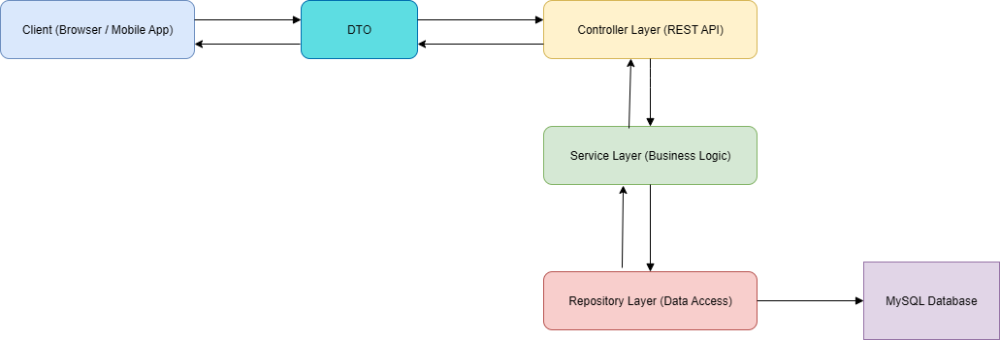

# Library Management System

## Architecture Design



## Data modeling and storage(ERD + sql)

- img

```
CREATE TABLE users (
    user_id INT AUTO_INCREMENT PRIMARY KEY,
    full_name VARCHAR(255) NOT NULL,
    email VARCHAR(255) NOT NULL UNIQUE,
    password VARCHAR(255) NOT NULL,
    age INT,
    gender ENUMS('MALE', 'FEMALE', 'OTHER') NOT NULL DEFAULT 'OTHER',
    status ENUMS('ENABLE', 'DISABLE') NOT NULL DEFAULT 'ENABLE',
    created_at DATETIME DEFAULT CURRENT_TIMESTAMP,
    updated_at DATETIME DEFAULT CURRENT_TIMESTAMP ON UPDATE CURRENT_TIMESTAMP,
);

CREATE TABLE roles (
    role_id INT AUTO_INCREMENT PRIMARY KEY,
    role_name VARCHAR(50),
    created_at DATETIME DEFAULT CURRENT_TIMESTAMP,
    updated_at DATETIME DEFAULT CURRENT_TIMESTAMP ON UPDATE CURRENT_TIMESTAMP,
)

CREATE TABLE user_role(
    user_role_id INT AUTO_INCREMENT PRIMARY KEY,
    user_id INT NOT NULL,
    role_id INT NOT NULL,
    created_at DATETIME DEFAULT CURRENT_TIMESTAMP,
    updated_at DATETIME DEFAULT CURRENT_TIMESTAMP ON UPDATE CURRENT_TIMESTAMP,
    CONSTRAINT fk_user FOREIGN KEY (user_id) REFERENCES users(user_id),
    CONSTRAINT fk_role FOREIGN KEY (role_id) REFERENCES roles(role_id),
)

CREATE TABLE genres(
    genre_id INT PRIMARY KEY,
    genre_name VARCHAR(255) NOT NULL UNIQUE,
    created_at DATETIME DEFAULT CURRENT_TIMESTAMP,
    updated_at DATETIME DEFAULT CURRENT_TIMESTAMP ON UPDATE CURRENT_TIMESTAMP,
)

CREATE TABLE authors(
    author_id INT PRIMARY KEY,
    full_name VARCHAR(255) NOT NULL,
    email VARCHAR(255) NOT NULL UNIQUE,
    age INT,
    created_at DATETIME DEFAULT CURRENT_TIMESTAMP,
    updated_at DATETIME DEFAULT CURRENT_TIMESTAMP ON UPDATE CURRENT_TIMESTAMP,
)

CREATE TABLE books(
    book_id INT AUTO_INCREMENT PRIMARY KEY,
    title VARCHAR(512) NOT NULL,
    book_code VARCHAR(255) NOT NULL UNIQUE,
    publish_year INT NOT NULL,
    available_count INT NOT NULL,
    borrowed_count INT NOT NULL,
    created_at DATETIME DEFAULT CURRENT_TIMESTAMP,
    updated_at DATETIME DEFAULT CURRENT_TIMESTAMP ON UPDATE CURRENT_TIMESTAMP,
)

CREATE TABLE book_author (
    book_author_id INT AUTO_INCREMENT PRIMARY KEY,
    book_id INT NOT NULL,
    author_id INT NOT NULL,
    created_at DATETIME DEFAULT CURRENT_TIMESTAMP,
    updated_at DATETIME DEFAULT CURRENT_TIMESTAMP ON UPDATE CURRENT_TIMESTAMP,
    CONSTRAINT fk_book FOREIGN KEY (book_id) REFERENCES books(book_id),
    CONSTRAINT fk_author FOREIGN KEY (author_id) REFERENCES authors(book_id),
)

CREATE TABLE book_genre(
    book_genre_id INT AUTO_INCREMENT PRIMARY KEY,
    book_id INT NOT NULL,
    genre_id INT NOT NULL,
    created_at DATETIME DEFAULT CURRENT_TIMESTAMP,
    updated_at DATETIME DEFAULT CURRENT_TIMESTAMP ON UPDATE CURRENT_TIMESTAMP,
    CONSTRAINT fk_book FOREIGN KEY (book_id) REFERENCES books(book_id),
    CONSTRAINT fk_genre FOREIGN KEY (genre_id) REFERENCES genres(genre_id),
)

CREATE TABLE borrow_book(
    borrow_book_id INT AUTO_INCREMENT PRIMARY KEY,
    user_id INT NOT NULL,
    book_id INT NOT NULL,
    status ENUMS('BORROWED', 'RETURNED') NOT NULL DEFAULT 'BORROWED',
    due_date DATETIME NOT NULL,
    created_at DATETIME DEFAULT CURRENT_TIMESTAMP,
    updated_at DATETIME DEFAULT CURRENT_TIMESTAMP ON UPDATE CURRENT_TIMESTAMP,
    CONSTRAINT fk_user FOREIGN KEY (user_id) REFERENCES users(user_id),
    CONSTRAINT fk_book FOREIGN KEY (book_id) REFERENCES books(book_id),
)

CREATE TABLE borrow_queue(
    borrow_queue_id INT AUTO_INCREMENT PRIMARY KEY,
    user_id INT NOT NULL,
    book_id INT NOT NULL,
    status ENUMS('PENDING', 'BORROWED') NOT NULL DEFAULT 'PENDING',
    created_at DATETIME DEFAULT CURRENT_TIMESTAMP,
    updated_at DATETIME DEFAULT CURRENT_TIMESTAMP ON UPDATE CURRENT_TIMESTAMP,
    CONSTRAINT fk_user FOREIGN KEY (user_id) REFERENCES users(user_id),
    CONSTRAINT fk_book FOREIGN KEY (book_id) REFERENCES books(book_id),
)

CREATE TABLE late_fee (
    late_fee_id INT AUTO_INCREMENT PRIMARY KEY,
    user_id INT NOT NULL,
    book_id INT NOT NULL,
    fee DECIMAL(10,2) NOT NULL DEFAULT 0.00,
    status ENUM('UNPAID', 'PAID') NOT NULL DEFAULT 'UNPAID',
    created_at DATETIME DEFAULT CURRENT_TIMESTAMP,
    updated_at DATETIME DEFAULT CURRENT_TIMESTAMP ON UPDATE CURRENT_TIMESTAMP,
    CONSTRAINT fk_late_fee_user FOREIGN KEY (user_id) REFERENCES user(user_id),
    CONSTRAINT fk_late_fee_book FOREIGN KEY (book_id) REFERENCES book(book_id)
);

```

## Security consideration

