# Library Management System

## Architecture Design

### 1. Actor
| STT | Actors | Description |
|-----|--------|-------------|
| 1   | ADMIN  | Quản trị viên hệ thống, quản lý tài khoản người dùng, xem lịch sử mượn trả sách của từng người dùng, quản lý và xử lý phí phạt khi người dùng trả sách trễ, theo dõi, xuất báo cáo các trường hợp quá hạn, quản lý danh sách chờ để đảm bảo sách được phân phối công bằng |
| 2   | USER   | Duyệt, tìm kiếm, lọc và xem thông tin chi tiết sách trong catalog, mượn và trả sách, theo dõi danh sách sách đang mượn cùng ngày đến hạn, tham gia danh sách chờ (waiting list) khi sách không có sẵn |

### 2. Use-case

#### 2.1 View Book Catalog
- Mục tiêu: Người dùng xem toàn bộ danh mục sách.
- Actor: User
- Luồng chính:
  - User truy cập “Catalog”.
  - Hệ thống hiển thị danh sách tất cả sách.
- Hậu điều kiện: User thấy danh mục sách.

#### 2.2 Search Books
- Mục tiêu: Tìm kiếm sách theo tiêu chí.
- Actor: User
- Luồng chính:
  - User nhập từ khóa tìm kiếm.
  - Hệ thống hiển thị danh sách kết quả phù hợp.
  - User chọn cách sắp xếp kết quả theo một tiêu chí (ví dụ: tên sách A–Z/Z–A, năm xuất bản)
- Luồng ngoại lệ: Không có kết quả → hiển thị thông báo.
- Hậu điều kiện: User thấy danh sách kết quả phù hợp.

#### 2.3 View Book Details
- Mục tiêu: Xem chi tiết thông tin một cuốn sách.
- Actor: User, Admin
- Luồng chính:
  - User chọn một cuốn sách.
  - Hệ thống hiển thị chi tiết thông tin cuốn sách
- Hậu điều kiện: User nắm thông tin chi tiết cuốn sách.

#### 2.4 Borrow Book
- Mục tiêu: Mượn một cuốn sách khả dụng.
- Actor: User
- Tiền điều kiện:
  - User không có phí phạt chưa thanh toán.
  - Sách ở trạng thái AVAILABLE.
  - User đã đăng nhập
- Luồng chính:
  - User chọn “Borrow”.
  - Hệ thống kiểm tra điều kiện.
  - Hệ thống ghi nhận việc mượn, cập nhật trạng thái sách.
  - Hệ thống hiển thị thông tin mượn sách bao gồm ngày đến hạn trả.
- Luồng ngoại lệ:
  - Có phí phạt chưa thanh toán → từ chối.
  - Sách hết → gợi ý tham gia Waiting List.
- Hậu điều kiện: User mượn thành công sách.

#### 2.5 View Borrowed Books
- Mục tiêu: Xem danh sách sách đang mượn của user.
- Actor: User, Admin
- Tiền điều kiện:
  - User, Admin đã đăng nhập
  - User chỉ xem được lịch sử mượn của mình
- Luồng chính:
  - User mở “My Borrowed Books”.
  - Hệ thống hiển thị danh sách sách và ngày đến hạn.
- Hậu điều kiện: User biết tình trạng mượn hiện tại.

#### 2.6 Return Book
- Mục tiêu: Trả sách đã mượn.
- Actor: User
- Tiền điều kiện: 	 
  - User đã đăng nhập.
  - Có sách đang mượn
- Luồng chính:
  - User chọn “Return”.
  - Hệ thống cập nhật trạng thái sách → AVAILABLE.
  - Hệ thống gửi xác nhận.
  - Nếu có Waiting List → thông báo cho user kế tiếp.
- Luồng ngoại lệ:
  - Trả muộn → hệ thống áp phí phạt.
  - Trả khi đã có phí phạt -> hệ thống yêu cầu xử lý phí phạt
- Hậu điều kiện: Sách được trả về thư viện.

#### 2.7 Join Waiting List
- Mục tiêu: Đăng ký vào danh sách chờ.
- Actor: User
- Tiền điều kiện:
  - Sách đã hết.
  - User đã đăng nhập
- Luồng chính:
  - User chọn “Join Waiting List”.
  - Hệ thống ghi nhận user vào danh sách.
  - Khi sách có sẵn → thông báo cho user đầu tiên.
- Luồng ngoại lệ:
  - User đang trong hàng chờ sách này -> hệ thống từ chối
  - Hậu điều kiện: User được xếp chỗ trong danh sách chờ.

#### 2.8 Create User Account
- Mục tiêu: Tạo mới tài khoản.
- Actor: Admin
- Tiền điều kiện:
  - Admin đã đăng nhập
- Luồng chính:
  - Admin nhập thông tin người dùng.
  - Hệ thống lưu và tạo tài khoản.
- Luồng ngoại lệ:
  - User đã tồn tại -> Hệ thống phản hồi thông báo
- Hậu điều kiện: User mới có thể đăng nhập.

#### 2.9 View/Modify User Info
- Mục tiêu: Xem và chỉnh sửa thông tin user.
- Actor: Admin, User
- Luồng chính:
  - Admin chọn tài khoản.
  - Hệ thống hiển thị thông tin.
  - Admin cập nhật thông tin.
  - Hệ thống lưu thay đổi.
- Hậu điều kiện: Thông tin user được cập nhật.

#### 2.10 View Borrowing History of User
- Mục tiêu: Xem lịch sử mượn/trả của user.
- Actor: Admin, User
- Tiền điều kiện:
  - Admin, User đã đăng nhập
  - User chỉ xem được đúng lịch sử của mình
- Luồng chính:
  - Admin chọn user.
  - Hệ thống hiển thị lịch sử mượn trả.
- Hậu điều kiện: Admin nắm lịch sử sử dụng của user.

#### 2.11 Issue Late Fee
- Mục tiêu: Áp phí phạt cho user trả muộn.
- Actor: Admin
- Tiền điều kiện: 
  - Có sách trả muộn.
- Luồng chính:
  - Admin xác nhận áp phí.
  - Hệ thống thông báo khoản phạt cho user
- Hậu điều kiện: User bị ràng buộc bởi phí phạt.

#### 2.12 Process Late Fee Payment
- Mục tiêu: Xử lý thanh toán phí phạt.
- Actor: Admin
- Tiền điều kiện: 
  - User chưa thanh toán.
- Luồng chính:
  - Admin ghi nhận thanh toán.
  - Hệ thống ghi nhận trả lại sách
  - Hệ thống cập nhật trạng thái thanh toán.
- Hậu điều kiện: User có thể mượn sách trở lại.

#### 2.13 View Overdue Reports
- Mục tiêu: Xem báo cáo sách quá hạn.
- Actor: Admin
- Tiền điều kiện
  - Admin đã đăng nhập
- Luồng chính:
  - Admin chọn “Overdue Reports”.
  - Hệ thống hiển thị danh sách sách quá hạn và user liên quan.
- Hậu điều kiện: Admin biết tình trạng nợ sách.

### 3. Use Case Diagram

#### 3.1 Admin

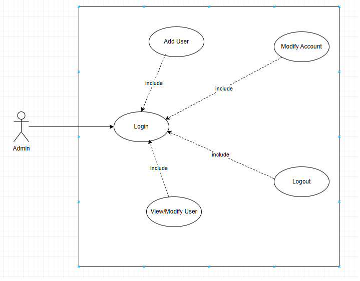

#### 3.2 Book Management

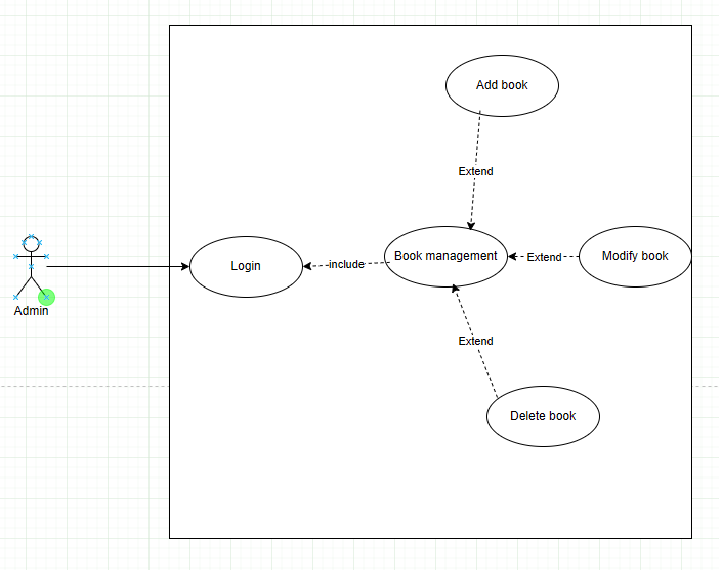

#### 3.3 Borrow book

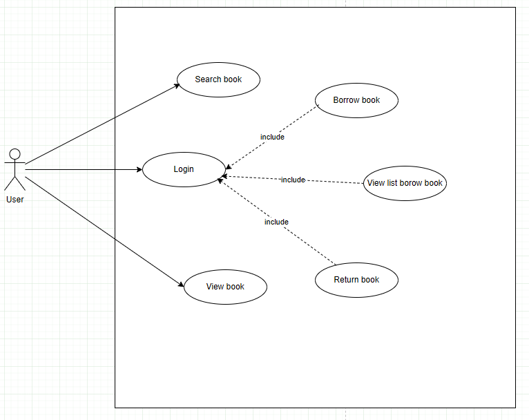

#### 3.4 Join book queue

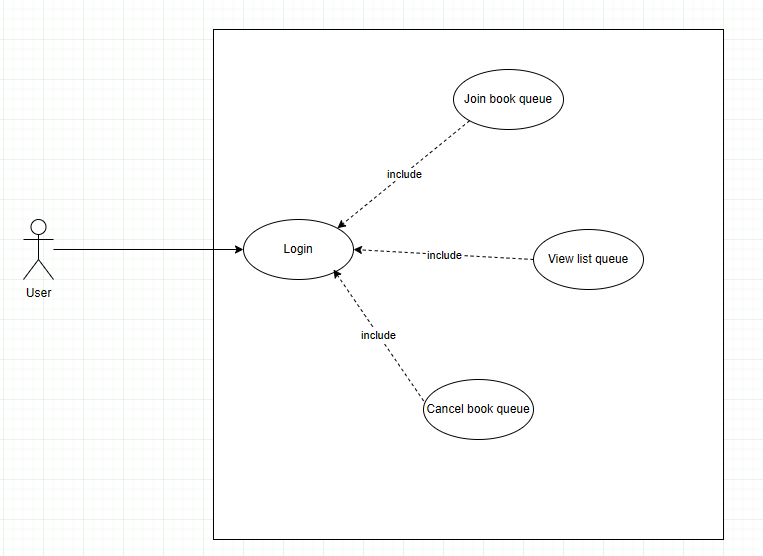

#### 3.5 Late fee

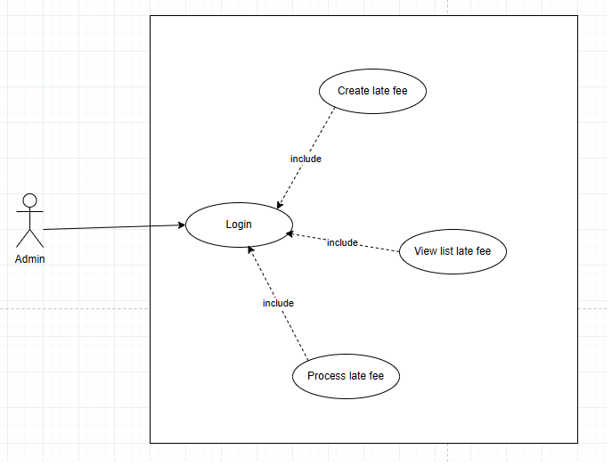

### 4. Sequence Diagram

#### 4.1 Create User

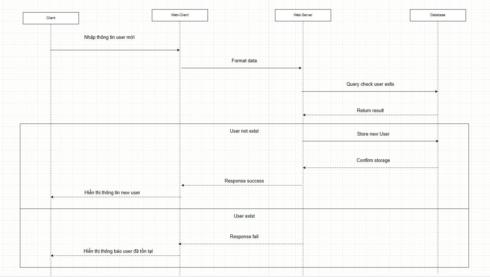

#### 4.2 Borrow book

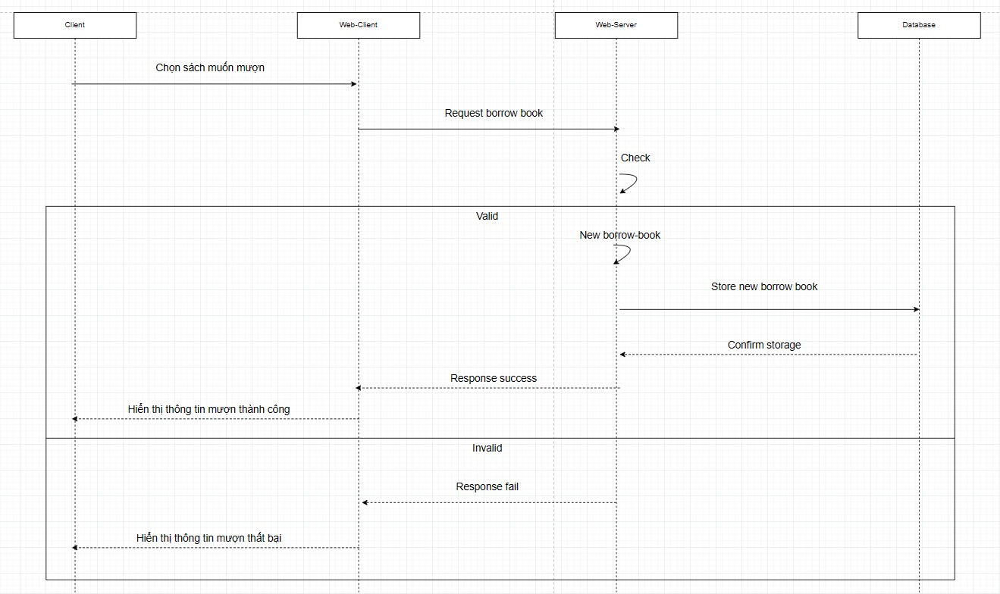

#### 4.3 Return book

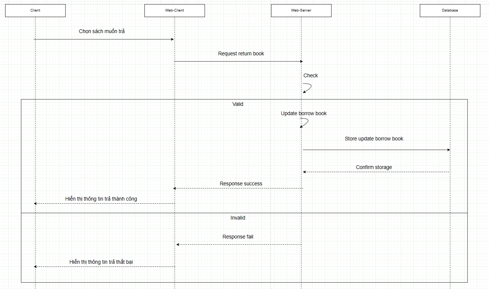

#### 4.4 Join book queue

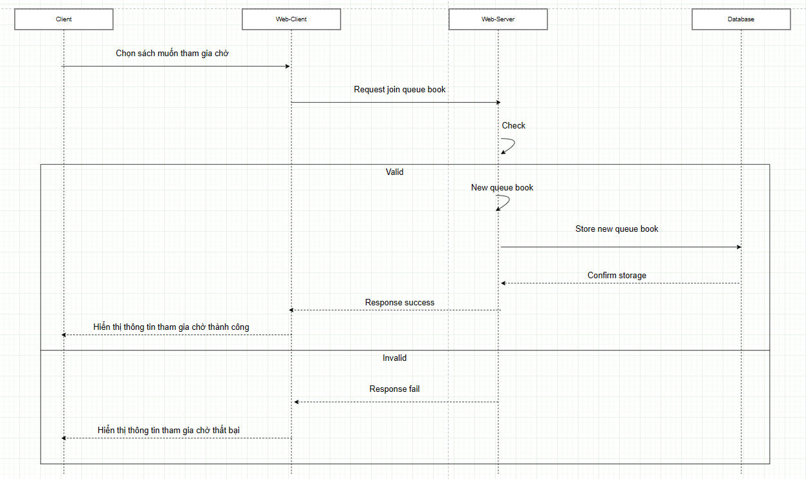


### 5. Business Rules
- BR-01: Một user chỉ được mượn tối đa 5 cuốn sách cùng lúc.
- BR-02: Phí phạt được tính = số ngày trễ × 5.000 VNĐ.
- BR-03: User có late fee chưa trả → không được mượn thêm sách.
- BR-04: Waiting list hoạt động theo nguyên tắc FIFO (first come, first served).


## Data modeling and storage(ERD + sql)


```
CREATE TABLE users (
    user_id INT AUTO_INCREMENT PRIMARY KEY,
    full_name VARCHAR(255) NOT NULL,
    email VARCHAR(255) NOT NULL UNIQUE,
    password VARCHAR(255) NOT NULL,
    age INT,
    gender ENUMS('MALE', 'FEMALE', 'OTHER') NOT NULL DEFAULT 'OTHER',
    status ENUMS('ENABLE', 'DISABLE') NOT NULL DEFAULT 'ENABLE',
    created_at DATETIME DEFAULT CURRENT_TIMESTAMP,
    updated_at DATETIME DEFAULT CURRENT_TIMESTAMP ON UPDATE CURRENT_TIMESTAMP,
);

CREATE TABLE roles (
    role_id INT AUTO_INCREMENT PRIMARY KEY,
    role_name VARCHAR(50),
    created_at DATETIME DEFAULT CURRENT_TIMESTAMP,
    updated_at DATETIME DEFAULT CURRENT_TIMESTAMP ON UPDATE CURRENT_TIMESTAMP,
)

CREATE TABLE user_role(
    user_role_id INT AUTO_INCREMENT PRIMARY KEY,
    user_id INT NOT NULL,
    role_id INT NOT NULL,
    created_at DATETIME DEFAULT CURRENT_TIMESTAMP,
    updated_at DATETIME DEFAULT CURRENT_TIMESTAMP ON UPDATE CURRENT_TIMESTAMP,
    CONSTRAINT fk_user FOREIGN KEY (user_id) REFERENCES users(user_id),
    CONSTRAINT fk_role FOREIGN KEY (role_id) REFERENCES roles(role_id),
)

CREATE TABLE genres(
    genre_id INT PRIMARY KEY,
    genre_name VARCHAR(255) NOT NULL UNIQUE,
    created_at DATETIME DEFAULT CURRENT_TIMESTAMP,
    updated_at DATETIME DEFAULT CURRENT_TIMESTAMP ON UPDATE CURRENT_TIMESTAMP,
)

CREATE TABLE authors(
    author_id INT PRIMARY KEY,
    full_name VARCHAR(255) NOT NULL,
    email VARCHAR(255) NOT NULL UNIQUE,
    age INT,
    created_at DATETIME DEFAULT CURRENT_TIMESTAMP,
    updated_at DATETIME DEFAULT CURRENT_TIMESTAMP ON UPDATE CURRENT_TIMESTAMP,
)

CREATE TABLE books(
    book_id INT AUTO_INCREMENT PRIMARY KEY,
    title VARCHAR(512) NOT NULL,
    book_code VARCHAR(255) NOT NULL UNIQUE,
    publish_year INT NOT NULL,
    available_count INT NOT NULL,
    borrowed_count INT NOT NULL,
    created_at DATETIME DEFAULT CURRENT_TIMESTAMP,
    updated_at DATETIME DEFAULT CURRENT_TIMESTAMP ON UPDATE CURRENT_TIMESTAMP,
)

CREATE TABLE book_author (
    book_author_id INT AUTO_INCREMENT PRIMARY KEY,
    book_id INT NOT NULL,
    author_id INT NOT NULL,
    created_at DATETIME DEFAULT CURRENT_TIMESTAMP,
    updated_at DATETIME DEFAULT CURRENT_TIMESTAMP ON UPDATE CURRENT_TIMESTAMP,
    CONSTRAINT fk_book FOREIGN KEY (book_id) REFERENCES books(book_id),
    CONSTRAINT fk_author FOREIGN KEY (author_id) REFERENCES authors(book_id),
)

CREATE TABLE book_genre(
    book_genre_id INT AUTO_INCREMENT PRIMARY KEY,
    book_id INT NOT NULL,
    genre_id INT NOT NULL,
    created_at DATETIME DEFAULT CURRENT_TIMESTAMP,
    updated_at DATETIME DEFAULT CURRENT_TIMESTAMP ON UPDATE CURRENT_TIMESTAMP,
    CONSTRAINT fk_book FOREIGN KEY (book_id) REFERENCES books(book_id),
    CONSTRAINT fk_genre FOREIGN KEY (genre_id) REFERENCES genres(genre_id),
)

CREATE TABLE borrow_book(
    borrow_book_id INT AUTO_INCREMENT PRIMARY KEY,
    user_id INT NOT NULL,
    book_id INT NOT NULL,
    status ENUMS('BORROWED', 'RETURNED') NOT NULL DEFAULT 'BORROWED',
    due_date DATETIME NOT NULL,
    created_at DATETIME DEFAULT CURRENT_TIMESTAMP,
    updated_at DATETIME DEFAULT CURRENT_TIMESTAMP ON UPDATE CURRENT_TIMESTAMP,
    CONSTRAINT fk_user FOREIGN KEY (user_id) REFERENCES users(user_id),
    CONSTRAINT fk_book FOREIGN KEY (book_id) REFERENCES books(book_id),
)

CREATE TABLE borrow_queue(
    borrow_queue_id INT AUTO_INCREMENT PRIMARY KEY,
    user_id INT NOT NULL,
    book_id INT NOT NULL,
    status ENUMS('PENDING', 'BORROWED') NOT NULL DEFAULT 'PENDING',
    created_at DATETIME DEFAULT CURRENT_TIMESTAMP,
    updated_at DATETIME DEFAULT CURRENT_TIMESTAMP ON UPDATE CURRENT_TIMESTAMP,
    CONSTRAINT fk_user FOREIGN KEY (user_id) REFERENCES users(user_id),
    CONSTRAINT fk_book FOREIGN KEY (book_id) REFERENCES books(book_id),
)

CREATE TABLE late_fee (
    late_fee_id INT AUTO_INCREMENT PRIMARY KEY,
    user_id INT NOT NULL,
    book_id INT NOT NULL,
    fee DECIMAL(10,2) NOT NULL DEFAULT 0.00,
    status ENUM('UNPAID', 'PAID') NOT NULL DEFAULT 'UNPAID',
    created_at DATETIME DEFAULT CURRENT_TIMESTAMP,
    updated_at DATETIME DEFAULT CURRENT_TIMESTAMP ON UPDATE CURRENT_TIMESTAMP,
    CONSTRAINT fk_late_fee_user FOREIGN KEY (user_id) REFERENCES user(user_id),
    CONSTRAINT fk_late_fee_book FOREIGN KEY (book_id) REFERENCES book(book_id)
);

```

## API design

### Authentication API
- POST /api/v1/auth/register
  - Tóm tắt: Đăng ký người dùng mới.
  - Mô tả: Tạo một tài khoản người dùng mới trong hệ thống. Chỉ người dùng có vai trò ADMIN mới được truy cập.
  - Request: email, fullName, age, gender
  - Response: bao gồm chi tiết người dùng và mật khẩu mặc định

- POST /api/v1/auth/login
  - Tóm tắt: Đăng nhập người dùng.
  - Mô tả: Xác thực người dùng bằng tên người dùng và mật khẩu, trả về access token và refresh token nếu thông tin xác thực hợp lệ.
  - Request Body: username, password
  - Response: token và thông tin người dùng

- POST /api/v1/auth/refresh
  - Tóm tắt: Làm mới token.
  - Mô tả: Tạo access token mới bằng refresh token hợp lệ. Kéo dài phiên mà không cần đăng nhập lại.
  - Request Body: refreshToken
  - Response: token mới

- POST /api/v1/auth/logout
  - Tóm tắt: Đăng xuất người dùng.
  - Mô tả: Hủy phiên hiện tại và token của người dùng. Đảm bảo người dùng không thể truy cập tài nguyên được bảo vệ cho đến khi đăng nhập lại.
  - Response: void

### Book API
- GET /api/v1/books
  - Tóm tắt: Lấy tất cả sách. 
  - Mô tả: Lấy danh sách phân trang của tất cả sách trong thư viện.
  - Parameters:
    - page (tùy chọn, mặc định: 1): Số trang.
    - size (tùy chọn, mặc định: 10): Số bản ghi trên mỗi trang.
  - Response: danh sách book

- POST /api/v1/books
  - Tóm tắt: Thêm sách mới.
  - Mô tả: Thêm một cuốn sách mới vào thư viện.
  - Request Body: 
    - title
    - authorIds
    - genreIds
    - publishYear
    - availableCount
  - Response: thông tin sách mới

- GET /api/v1/books/{id}
  - Tóm tắt: Lấy sách theo ID.
  - Mô tả: Lấy chi tiết của một cuốn sách cụ thể.
  - Parameters:
    - id: ID của sách.
  - Response: thông tin của sách

- DELETE /api/v1/books/{id}
  - Tóm tắt: Xóa sách theo ID.
  - Mô tả: Xóa mềm một cuốn sách khỏi thư viện.
  - Parameters:
    - id: ID của sách. 
  - Response: void

- GET /api/v1/books/search
  - Tóm tắt: Tìm kiếm sách.
  - Mô tả: Tìm kiếm sách dựa trên các tiêu chí như tiêu đề, tác giả. Trả về danh sách sách phù hợp.
  - Parameters:
    - page (tùy chọn, mặc định: 1): Số trang.
    - size (tùy chọn, mặc định: 10): Số bản ghi trên mỗi trang.
  - Request Body: keyword
  - Response: Danh sách thông tin các cuốn sách

- GET /api/v1/books/genre/{name}
  - Tóm tắt: Lấy sách theo thể loại.
  - Mô tả: Lấy danh sách phân trang của tất cả sách theo thể loại.
  - Parameters:
    - name (bắt buộc): Tên thể loại.
    - page (tùy chọn, mặc định: 1): Số trang.
    - size (tùy chọn, mặc định: 10): Số bản ghi trên mỗi trang.
  - Response: Danh sách thông tin các cuốn sách

- GET /api/v1/books/author/{name}
  - Tóm tắt: Lấy sách theo tác giả.
  - Mô tả: Lấy danh sách phân trang của tất cả sách theo tác giả.
  - Parameters:
    - name (bắt buộc): Tên tác giả.
    - page (tùy chọn, mặc định: 1): Số trang.
    - size (tùy chọn, mặc định: 10): Số bản ghi trên mỗi trang.
- Response: Danh sách thông tin các cuốn sách

### Borrow Book API
- POST /api/v1/borrow
  - Tóm tắt: Mượn sách.
  - Mô tả: Cho phép người dùng mượn một cuốn sách từ thư viện. Tạo bản ghi mượn mới và giảm số lượng sách có sẵn.
  - Request Body: userId, bookId, duration
  - Response: Thông tin mượn sách

- POST /api/v1/borrow/return
  - Tóm tắt: Trả sách đã mượn.
  - Mô tả: Cho phép người dùng trả lại sách đã mượn trước đó. Cập nhật bản ghi mượn và tăng số lượng sách có sẵn.
  - Request Body: BorrowBookRequest (userId, bookId).
  - Response: Thông tin trả sách

- GET /api/v1/borrow/list/user/{id}
  - Tóm tắt: Lấy bản ghi mượn của người dùng.
  - Mô tả: Lấy danh sách phân trang của tất cả sách được mượn bởi một người dùng cụ thể (ADMIN hoặc chính người dùng).
  - Parameters:
    - id (bắt buộc): ID của người dùng.
    - page (tùy chọn, mặc định: 1): Số trang.
    - size (tùy chọn, mặc định: 10): Số bản ghi trên mỗi trang.
  - Response: Danh sách mượn sách của user.

- GET /api/v1/borrow/list/overdue
  - Tóm tắt: Lấy bản ghi mượn quá hạn.
  - Mô tả: Lấy danh sách phân trang của tất cả bản ghi mượn quá hạn (chưa trả đúng hạn) (ADMIN chỉ).
  - Parameters:
    - page (tùy chọn, mặc định: 1): Số trang.
    - size (tùy chọn, mặc định: 10): Số bản ghi trên mỗi trang.
  - Response: Danh sách các lượt đang mượn sách bị quá hạn

- GET /api/v1/borrow/list/book/{id}
  - Tóm tắt: Lấy bản ghi mượn của một sách.
  - Mô tả: Lấy danh sách phân trang của tất cả bản ghi mượn cho một cuốn sách cụ thể (ADMIN chỉ).
  - Parameters:
    - id (bắt buộc): ID của sách.
    - page (tùy chọn, mặc định: 1): Số trang.
    - size (tùy chọn, mặc định: 10): Số bản ghi trên mỗi trang.
  - Response: Danh sách mượn sách của theo sách

- GET /api/v1/borrow/list
  - Tóm tắt: Lấy tất cả lượt mượn sách.
  - Mô tả: Lấy danh sách phân trang của tất cả bản ghi mượn trong hệ thống (ADMIN chỉ).
  - Parameters:
    - page (tùy chọn, mặc định: 1): Số trang.
    - size (tùy chọn, mặc định: 10): Số bản ghi trên mỗi trang.
  - Response: Danh sách mượn sách.

### Book Queue APIs
- POST /api/v1/book-queue
  - Tóm tắt: Tham gia danh sách chờ.
  - Mô tả: Thêm người dùng hiện tại vào danh sách chờ cho một cuốn sách cụ thể (ADMIN hoặc chính người dùng).
  - Request Body: 
    - bookId 
    - userId
    - duration
  - Response: Thông tin tham gia hàng chờ

- DELETE /api/v1/book-queue
  - Tóm tắt: Hủy danh sách chờ.
  - Mô tả: Hủy yêu cầu danh sách chờ cho một cuốn sách cụ thể (ADMIN hoặc người dùng đã tạo yêu cầu).
  - Request Body: 
    - bookQueueId 
    - userId
  - Response: void

- GET /api/v1/book-queue/user/{id}
  - Tóm tắt: Lấy danh sách chờ của người dùng.
  - Mô tả: Lấy danh sách phân trang của các sách mà người dùng được chỉ định đang chờ (ADMIN hoặc chính người dùng).
  - Parameters:
    - id (bắt buộc): ID của người dùng. 
    - page (tùy chọn, mặc định: 1): Số trang.
    - size (tùy chọn, mặc định: 10): Số bản ghi trên mỗi trang.
  - Response: Danh sách thông tin chờ của người dùng.

- GET /api/v1/book-queue/book/{id}
  - Tóm tắt: Lấy danh sách chờ của một cuốn sách.
  - Mô tả: Lấy danh sách phân trang của người dùng đang chờ một cuốn sách cụ thể (ADMIN chỉ).
  - Parameters:
    - id (bắt buộc): ID của sách.
    - page (tùy chọn, mặc định: 1): Số trang.
    - size (tùy chọn, mặc định: 10): Số bản ghi trên mỗi trang.
  - Response: Danh sách thông tin chờ của một cuốn sách.

### Late Fee API

- GET /api/v1/late-fee
  - Tóm tắt: Lấy tất cả phí trễ hạn.
  - Mô tả: Lấy danh sách phân trang của tất cả bản ghi phí trễ hạn trong hệ thống (ADMIN chỉ).
  - Parameters:
    - page (tùy chọn, mặc định: 1): Số trang.
    - size (tùy chọn, mặc định: 10): Số bản ghi trên mỗi trang.
  - Response: Danh sách các phiếu phí trễ hạn.

- POST /api/v1/late-fee
  - Tóm tắt: Tạo bản ghi phí trễ hạn.
  - Mô tả: Tạo bản ghi phí trễ hạn mới cho người dùng trả sách sau hạn chót (ADMIN chỉ).
  - Request Body: LateFeeCreationRequest (userId, bookId, fee, description).
  - Response: Thông tin phí trễ hạn.

- GET /api/v1/late-fee/{id}
  - Tóm tắt: Lấy phí trễ hạn của người dùng. 
  - Mô tả: Lấy danh sách phân trang của bản ghi phí trễ hạn cho một người dùng cụ thể (ADMIN hoặc chính người dùng).
  - Parameters:
    - id (bắt buộc): ID của người dùng. 
    - page (tùy chọn, mặc định: 1): Số trang.
    - size (tùy chọn, mặc định: 10): Số bản ghi trên mỗi trang.
  - Response: Danh sách thông tin phí trễ hạn của người dùng.

- PATCH /api/v1/late-fee/{id}
  - Tóm tắt: Đánh dấu phí trễ hạn là đã thanh toán.
  - Mô tả: Cập nhật bản ghi phí trễ hạn để đánh dấu là đã thanh toán (ADMIN chỉ).
  - Parameters:
    - id (bắt buộc): ID của phí trễ hạn. 
  - Response: Thông tin thanh toán.

### User APIs

- GET /api/v1/user/{id}
  - Tóm tắt: Lấy thông tin người dùng.
  - Mô tả: Lấy thông tin hồ sơ của một người dùng cụ thể theo ID người dùng (ADMIN hoặc chính người dùng).
  - Parameters:
    - id (bắt buộc): ID của người dùng.
  - Response: ApiResponseUserResponse.

- PATCH /api/v1/user/{id}
  - Tóm tắt: Cập nhật thông tin người dùng.
  - Mô tả: Cập nhật chi tiết hồ sơ của một người dùng cụ thể theo ID người dùng (ADMIN hoặc chính người dùng).
  - Parameters:
    - id (bắt buộc): ID của người dùng.
  - Response: ApiResponseVoid.


## Security consideration

### 1. Xác thực và Phân quyền
- Tất cả người dùng phải đăng nhập bằng tên đăng nhập và mật khẩu hợp lệ.
- Mật khẩu phải được băm (hash) và thêm muối (salt) trước khi lưu trữ (sử dụng bcrypt).
- Cơ chế **Phân quyền theo vai trò (RBAC)** phải được áp dụng:
    - **Người dùng (User)** có thể duyệt catalog, mượn/trả sách, quản lý tài khoản cá nhân và tham gia danh sách chờ.
    - **Quản trị viên (Admin)** có thể quản lý tài khoản người dùng, phí phạt, danh sách chờ và xem báo cáo.
- Token phải hết hạn sau 1 ngày không hoạt động.
- Quyền truy cập các chức năng quản trị phải được giới hạn cho tài khoản có vai trò `ADMIN`.

- Luồng login

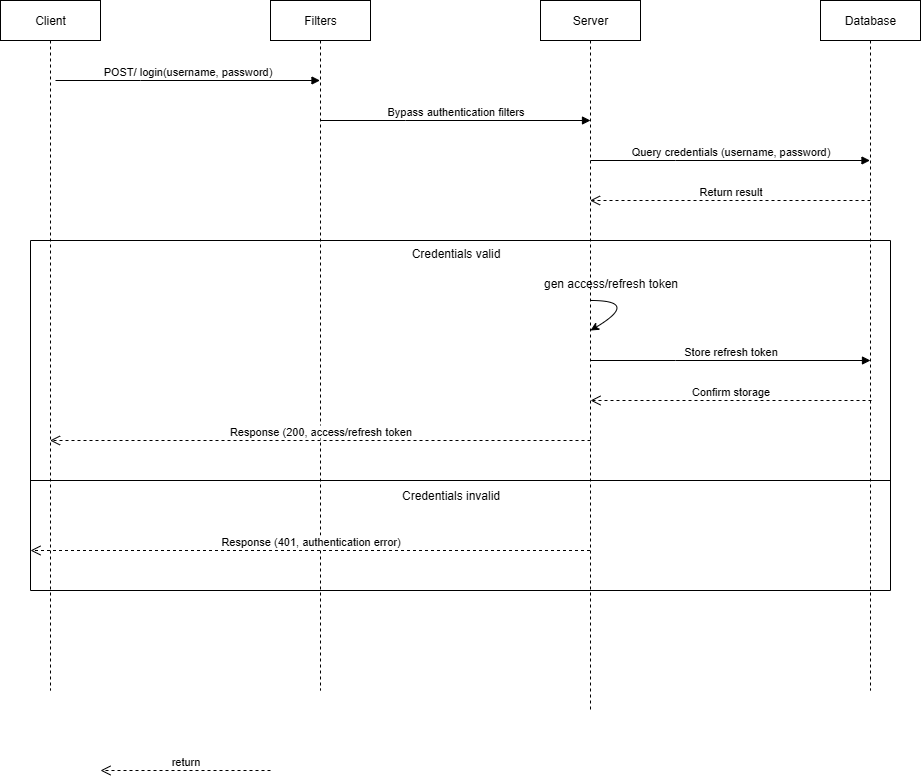

- Luồng logout

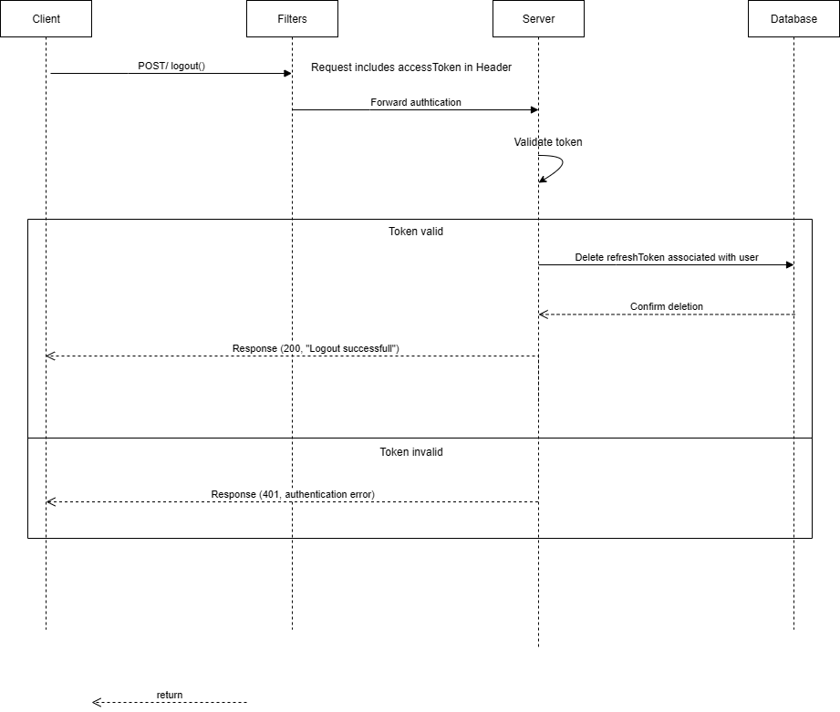

- Luồng refresh-token

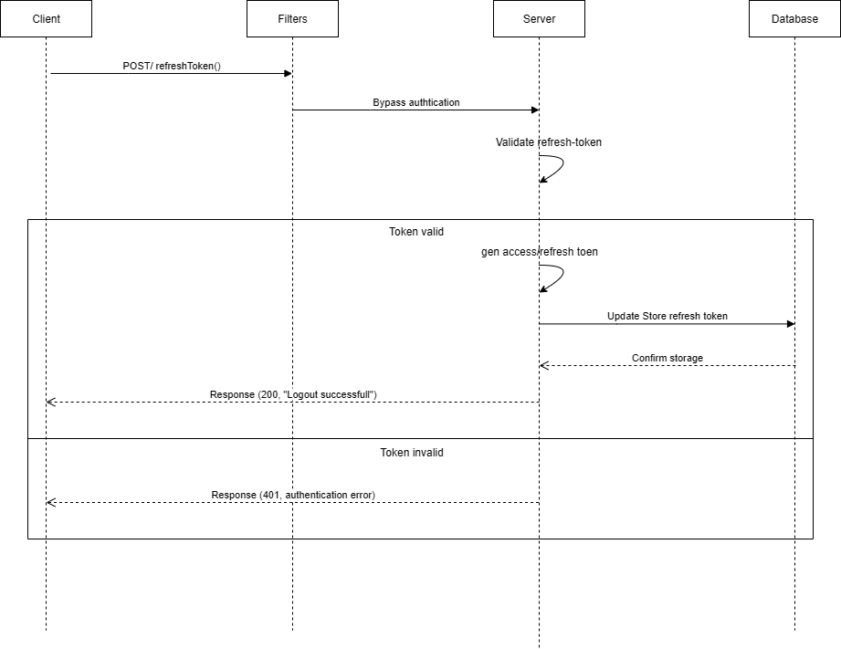

### 2. Bảo mật Dữ liệu
- Dữ liệu nhạy cảm như mật khẩu, giao dịch thanh toán và thông tin cá nhân phải được mã hóa khi truyền và khi lưu trữ.
- Truy cập cơ sở dữ liệu phải được giới hạn cho các dịch vụ đã được cấp quyền.

### ### 3. Kiểm tra đầu vào và Bảo vệ khỏi tấn công
- Validate toàn bộ dữ liệu từ request, kiểm soát rủi ro tấn công